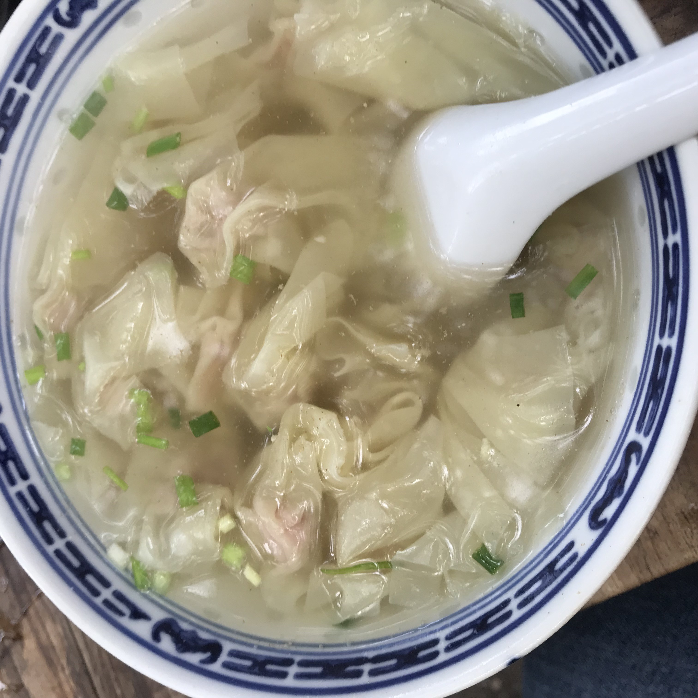

# This is Jeff's awesome website
 

# lets add some links

I often use [google](https://www.google.com) to do data science

#lets have image
here's my food.



```{r setup, include=FALSE}
knitr::opts_chunk$set(echo = TRUE)
```

